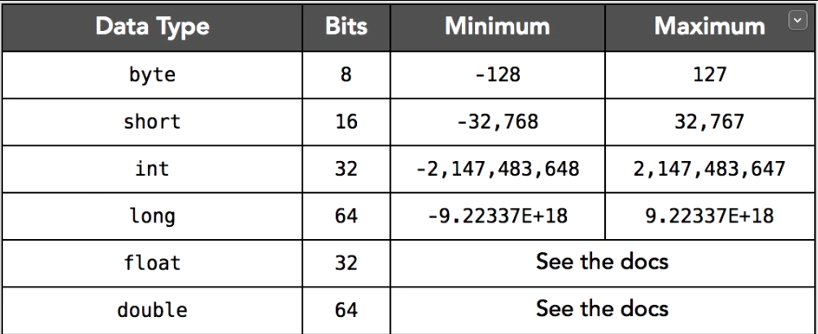
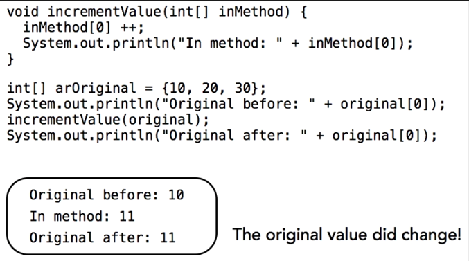
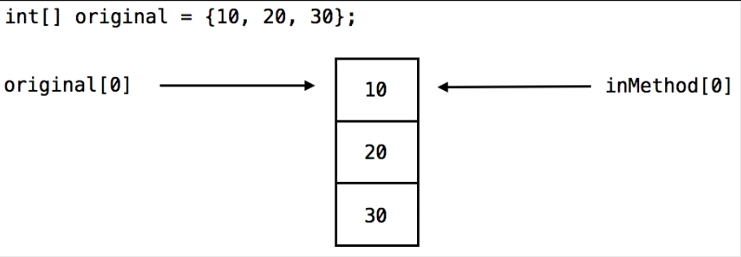
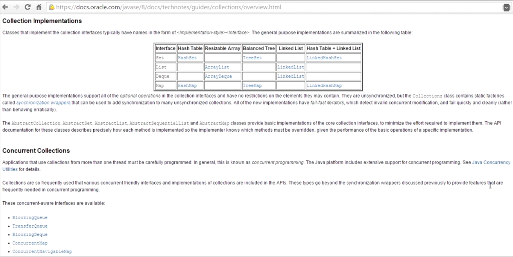

# Java Essential Training

Java 8 é a versão LTS mais utilizada de Java, seguido por Java 11. A diferença é que Java 11 introduziu inferência de tipo, ou seja, caso criemos uma variável com a palavra var (em vez de int, float,…), o tipo será inferido automaticamente.

- Funções são chamadas de Métodos
- Propriedades são chamadas de Campos
- javac -> compilador que transforma teu código em bytecode que pode ser interpretado pela JVM
- Os comandos java rodam os arquivos bytecode compilados
- Existem dois tipos de memória, stack e heap
- Stack é mais rápida, e Heap é mais dinâmica e armazena objetos e variáveis maiores.
- O Garbage Collector vai apagar uma variável apenas quando todos as outras variáveis do teu programa que dependem dessa variável terminarem sua execução.
- As variáveis elegíveis expiram junto com o seu escopo de método ou bloco de código.
- *System.gc()* e *Runtime.gc()* podem invocar o Garbage Collector, mas não há garantia de que ele vai rodar.
- *Runtime.maxMemory()* e *Runtime.totalMemory()* ajudam a descobrir informações sobre a memória da JVM.

## Keywords

***static*** -> sinaliza que um membro da classe pode ser chamado apenas pela sua própria classe e não de uma instância da classe. Quando não possui *static* e não é um método, podemos dizer que é um campo da classe e que não é um membro da classe, mas sim um membro da instância da classe.
***protected***  -> o método protected pode ser utilizado por qualquer outra classe que esteja no mesmo pacote
***private*** -> quando tornamos um campo private, estamos falando que apenas os métodos setters e getters podem modificar o valor deles, através de uma chamada feita por uma instância.
***final*** -> não pode mudar o valor

## Conventions
 
- Classes começam com letra maiúscula
- Métodos e variáveis começam com letra minúscula
- Constantes são todas em maiúsculas e “static final”
- Sempre existem packages escritos em reverse domain notation
- Member of a class: 

## Shortcuts
 
- Shift + F2 -> abre a documentação online do Java de determinada palavra
- Option + arrows -> move a linha de lugar
- Command + D -> apaga linha em branco
- Command + Control + arrows-> duplica a linha
- Shift + Option + arrows -> seleciona palavras
- Command + K -> vai para a próxima ocorrência da palavra
- Option + Command + Z -> mostra as opções de Surround with de um trecho de código selecionado
- Ctrl + D do VSCode -> botão direito na palavra e Refactor -> Rename

## Variables
 
- Tipo de dado primitivo: números, chars e booleanos. São escritos em lowercase
- Tipo de dado objeto: String 
- Abaixo são listados os tipos numéricos primitivos


- Cada tipo primitivo them uma helper class associada que possui métodos de conversão de dados e formatação. Os nomes dessas classes são iguais aos tipos, mas começam com letra maiúscula. Com exceção de *int*, cuja classe é *Integer*.

## Objects

- Para comparação de strings, não utilizar os operadores normais (= e !=). Utilizar o método da classe ***String.equals()*** e ***String.notEquals()***.
- Diferenciar métodos estáticos de métodos de instância. Estáticos são da classe e de instância são utilizados pela instância da classe.

## Debugging

- Prestar atenção com a opção “Skip all breakpoints”.
- Step Into (F5) entra nas chamadas de métodos e debugga a chamada da linha destacada.
- Step Over (F6) executa a linha destacada e pausa antes da execução da próxima linha.
- Resume (F8) volta a execução normal até encontrar o próximo breakpoint
- Stop (Command + F2) termina a execução
- Posso adicionar um breakpoint na metade do debug.
- Ao clicar com o botão direito no breakpoint e ir em propriedades, posso estar uma condição. O debugger só vai parar quando aquela condição se satisfizer.
- Ao selecionar uma expressão e clicar com o botão direito, posso adicionar ela nos “Watches”, e seu valor será mostrado ao lado na aba “Expressions”
- Ao debuggar, mudar para a perspectiva de Debug no canto superior direito do Eclipse. E ao terminar o debug, voltar a perspectiva Java.

## Exception Handling

- Cada Try Catch deve gerenciar um tipo de erro apenas. Depois de descoberto um erro que pode ser gerado dependendo dos inputs, o tipo deste erro deve ser adicionado no catch. Para outros erros, criamos um novo bloco Catch. 
- Pode-se usar Try Catch Catch Catch ...
- Posso criar meu próprio erro usando throw.

## Overloading

- Pode-se criar mais de uma versão de um mesmo método, basta diferenciá-los pelo número de argumentos ou tipos dos argumentos requeridos. Assim o JRE vai saber qual dos métodos deve chamar.

## Arguments by Copy or Reference

- Passar um argumento por cópia: a variável que enviamos não está atrelada ao método, então o método recebe uma cópia dos argumentos.
- Passar um argumento por referência: a variável/objeto que enviamos passa a referência da variável/objeto original para o método. Ou seja, se fizermos alguma mudança nessa variável dentro do método, essa mudança vai ser cascateada para o escopo de onde essa variável foi inicialmente declarada. Ou seja, os métodos podem modificar variáveis de fora dele.
### No Java, todas as variáveis passadas para métodos são por cópia!!!!!

- Em valores primitivos, é esse o comportamento.
- Mas com objetos complexos, como um array por exemplo, o argumento continua não passando por referência, mas é como se fosse. Quando criamos um array, a posição 0 dele vai estar apontando para o objeto array. Ou seja, temos uma cópia. Quando passamos por argumento, criamos uma segunda cópia do objeto com o mesmo valor da posição 0. Se incrementarmos a posição 0 de uma cópia, a mudança vai cascatear para a outra cópia também. Não sei se é isso, mas foi o que eu entendi.

- Strings são objetos complexos imutáveis, por isso o comportamento mostrado nas imagens acima não acontece. Porém, isso acontece para a maioria dos objetos complexos.

## List & Map


## Constructors

- Uma classe pode ter múltiplos construtores, seguindo o princípio de Overloading explicado acima (desde que os tipos ou quantidade de parâmetros sejam diferentes).

## Inheritance22

- No Java, uma classe só pode herdar de outra classe e não de mais de uma, como é permitido em algumas outras linguagens  
- Mas por outro lado, uma classe pode implementar mais de uma interface ao mesmo tempo
- Interface é mais ou menos a mesma coisa que um classe abstrata, mas a classe abstrata pode ter métodos já implementados, enquanto interface só pode ter a assinatura dos métodos.

